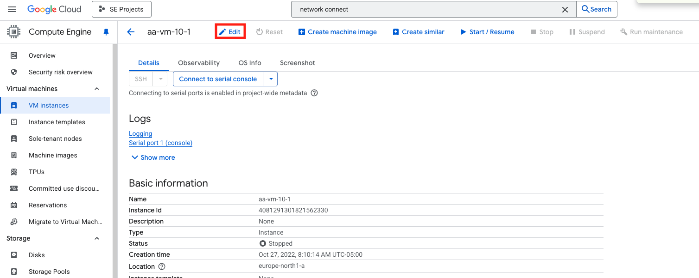
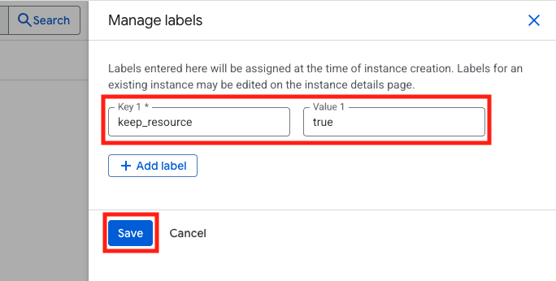
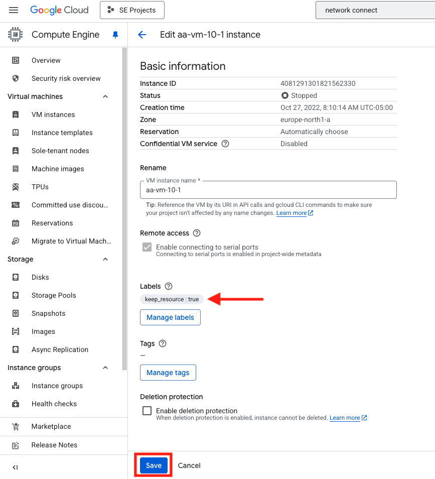
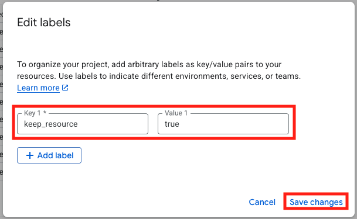
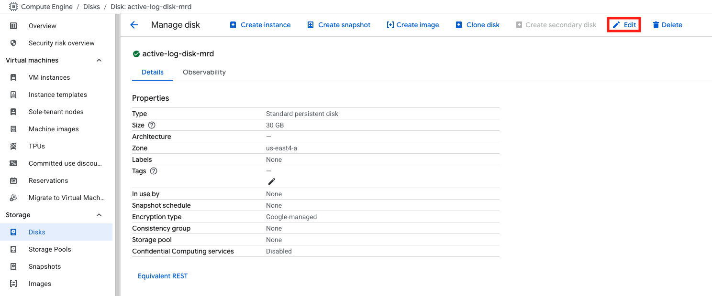
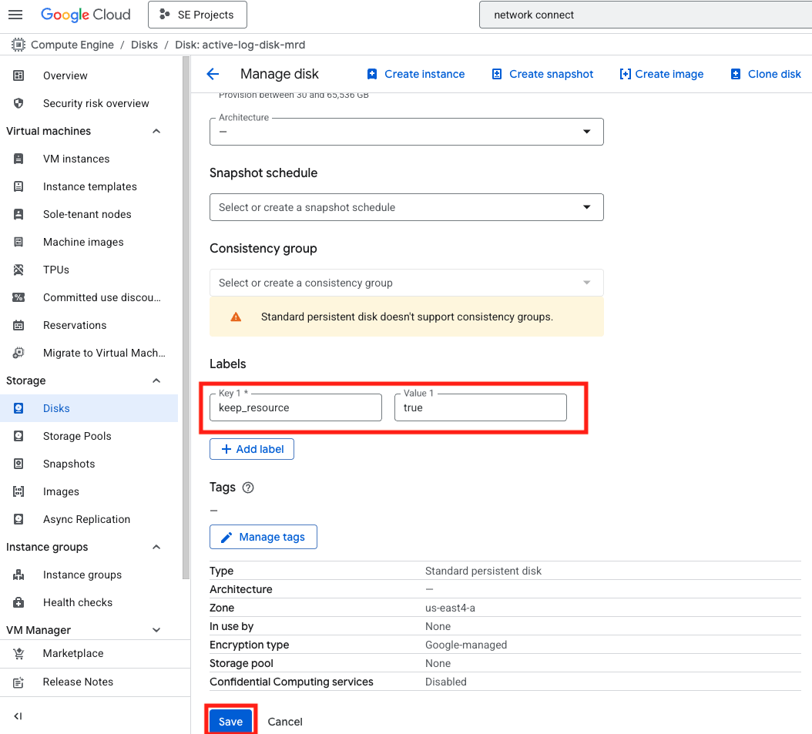
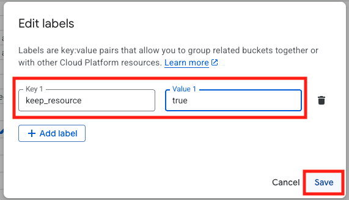

# Label GCP Resources

This document will cover how to add a label to GCP Resources.  This is part of the cost savings project to reduce unused resources in GCP.  Only resources containing the appropriate label will be preserved.  All other resources will be deleted.

> [!NOTE]
> Labels are key-value pairs that can be used on Google Cloud to group related or associated resources. For example, on Compute Engine, you can use labels to group VMs in categories such as production, staging, or development so that you can search for resources that belong to each development stage. After adding labels to your resources, you can take advantage of the nested filtering feature to perform more precise searches for your resources using labels.

For the purposes of this exercise, all VM Instances, GKE clusters, disks and storage buckets will need to be labeled.  The below sections highlight this process.

> [!Important]
> The label key will be **keep_resource** the label value will be **true**

## Add Label to VM Instances

Use this procedure to add the required label to all VMs that you want to preserve.

> [!TIP]
> If there are already labels on the VM, you can just add a new label.

1. Navigate to Compute Engine > VM instances and click on the VM Name in order to navgate to the details screen.
1. Click on **Edit** at the top of the screen.

    

1. Click on the **Manage labels** button in the middle of the screen.  This will open a box to the right hand side of the screen.
1. Click on the **Add Label** button
1. In the "Key" box enter **keep_resource**
1. In the "Value" box enter **true**
1. Click **Save**

    

1. You will now see the labels on the details screen.
1. You will need to click **Save** again at the bottom of the page.

    

> [!TIP]
> In this example, the VM is stopped.  This is not necessary in order to add the label.

## Add Label to Kubernetes Cluster

Use this procedure to add the required label to all Kubernetes clusters that you want to preserve.

1. Navigate to Kubernetes Engine > Clusters and click on the VM Name in order to navgate to the details screen
1. Scroll down to the **Metada** section
1. Click on the pencil icon next to Labels.  This will open a box in the middle of your screen.
1. Click on the **Add Label** button
1. In the "Key" box enter **keep_resource**
1. In the "Value" box enter **true**
1. Click **Save changes**

    

1. You are done!

## Add Label to Disk

Use this procedure to add the required label to any disk you want to preserve.

> [!Note]
> This only needs to be done if you have unattached disks that you would like to reuse to create a VM later.  

1. Navigate to Compute Engine > Disks and clidk on the Disk name in order to navigate to the details screen
1. Click **Edit** At the top right side of the screen

    

1. Click on the **Add Label** button
1. In the "Key" box enter **keep_resource**
1. In the "Value" box enter **true**
1. Scroll to the bottom of the page and click **Save**

    

1. You should now see the label on the disk

## Add Label to Storage Bucket

Use this procedure to add the required label to any storage buckets you want to preserve.

1. Navigate to Cloud Storage > Buckets and click on the bucket name in order to navigate to the details screen.
1. Click on the pencil icon next to Labels.  This will open a box in the middle of your screen.
1. Click on the **Add Label** button
1. In the "Key" box enter **keep_resource**
1. In the "Value" box enter **true**
1. Click **Save**

    

1. You are done!